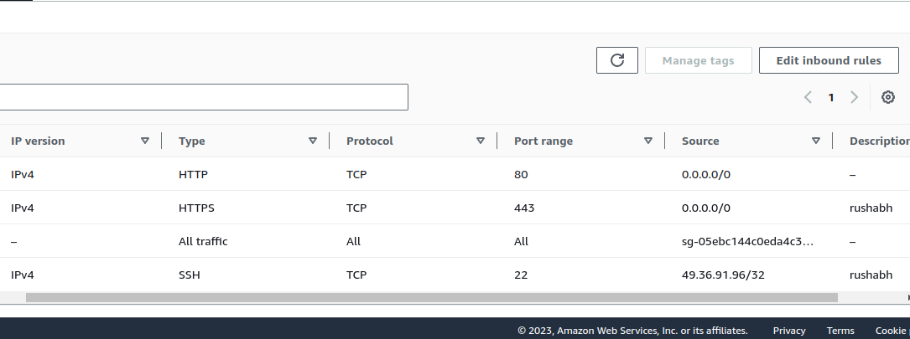

# discoze

Discover and Converse with friends through AI Twins


## About

This project uses reflex.dev framework to create https://www.discoze.work website in pure python.
The boilerplate SaaS code for this project is implemented via PySaaS.io.


## Setup

1. Setting up the machine:
   ```
   ssh -i key.cer ubuntu@65.2.125.10
   sudo apt-get update
   sudo apt install python3.10-venv
   sudo apt-get install unzip
   ssh-keygen -t ed25519 -C "example@gmail.com"
   cat .ssh/id_ed25519.pub
   Paste this to Github SSH Keys so that machine can access Github.
   ```

2. Clone repo, create and activate virtual env:
    ```
   git clone git@github.com:rushout09/discoze_website.git
   cd discoze_website 
   python3 -m venv venv
   source venv/bin/activate
    ```
3. Install requirements:
    ```
   pip install -r requirements.txt
   [or if that takes time]
   pip install -r requirements2.txt
    ```
4. Create a .env file with following keys
   ```
    FIREBASE_API_KEY=
    FIREBASE_AUTH_DOMAIN=
    FIREBASE_DB_URL=
    FIREBASE_PROJECT_ID=
    FIREBASE_STORAGE_BUCKET=
    FIREBASE_MSG_SENDER_ID=
    FIREBASE_APP_ID=
    FIREBASE_MEASUREMENT_ID=
    LM_API_KEY=
    LM_SIGNING_SECRET=
    LM_URL=
    NOTION_API_KEY=
    NOTION_DB_ID=
   ```
5. Create systemd service [Only for production. Follow step 5 for running locally]
   ```
   sudo nano /etc/systemd/system/discoze-website.service
   Paste the example.service file
   sudo systemctl enable discoze-website.service 
   sudo systemctl start discoze-website.service
   ```
6. Run locally with command:
   ```
   reflex run
   ```
7. Confirm if the ports are active
   ```
   sudo lsof -i -P -n | grep LISTEN
   ```

### Minimal AWS Setup steps.

The frontend runs on port 3000 by default.
The backend runs on port 8000 by default.
According to documentation, the backend host needs to be publicly accessible for frontend to access it.
That's why we run backend on https://backend.discoze.work and frontend on https://www.discoze.work
We set the backend host as API_URL env var in example.service (systemd) file.

While setting up our load balancer, 
we redirect all request that come to port 80 to port 443.
We forward all request from 443 at backend.discoze.work to target group with port 8080.
We forward all request from 443 at *.discoze.work to target group with port 3030.

We only open port 443 and 80 for public on our security group for load balancer.
All ports are open on machine for traffic coming from inside the VPC from same Security Group.

1. Create a VPC with a public subnet.
2. Have the following default Security Group:

3. Create minimum t3.small (2cpu, 2gb) machine to compile and build to run.
4. Create an ACM certificate with your domain (Optional).
5. Create two target groups as follows:

6. Create a load balancer with following rules:


